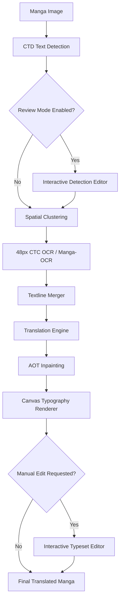

# Manga Translator Android

[](https://kotlinlang.org)
[](https://developer.android.com)
[](https://developer.android.com/jetpack/compose)
[](https://onnxruntime.ai)
[](https://github.com/yuu18id/manga-image-translator/releases)
[](LICENSE)

Native Android application based on [zyddnys/manga-image-translator](https://github.com/zyddnys/manga-image-translator), providing on-device AI manga translation, interactive text bubble correction, manual typesetting adjustment, and chapter batch processing powered by ONNX Runtime Mobile, OpenCV, and Jetpack Compose (Material Design 3).

Optimized specifically for translating raw **Japanese Manga (`JA / JPN`)** into **English, and other target languages** directly on mobile devices with comic-grade typesetting and neural inpainting.

> [!WARNING]
> ### Disclaimer
> * **Hardware Requirements:** Running deep learning models directly on-device requires sufficient RAM and CPU processing. Performance depends on device specifications.
> * **Source Language Specialization:** The on-device OCR model and dictionary are specialized for Japanese Manga typography (Kanji, Hiragana, Katakana, Romaji, and common comic symbols). Translating non-Japanese comics is not supported for now.
> * **Edge Cases:** Highly distorted handwritten script, dense sound effects (SFX), or degraded low-resolution scans may require manual adjustment via the built-in interactive editors.

---

## Showcase

### Workflow Demonstration
<!-- PLACEHOLDER: Drop your animated workflow GIF into docs/assets/workflow_demo.gif -->
<div align="center">
  
  <p><em>Complete pipeline demonstration: Image Selection &rarr; Text Detection &rarr; Cloud LLM Translation &rarr; Neural Inpainting &rarr; WYSIWYG Typeset Editing</em></p>
</div>

<br>

### Before & After Comparison

| Original Japanese Scan | Translated & Inpainted Result |
| :---: | :---: |
| <!-- PLACEHOLDER: docs/assets/before_after_sample_1_before.jpg --><br><br><em>Raw Japanese Manga Scan</em> | <!-- PLACEHOLDER: docs/assets/before_after_sample_1_after.jpg --><br><br><em>Translated Output with CC Wild Words Typesetting</em> |

<details>
<summary><b>View Additional Before & After Samples</b></summary>

<br>

| Original (Raw Japanese) | Translated Result |
| :---: | :---: |
| <!-- PLACEHOLDER: docs/assets/before_after_sample_2_before.jpg --><br> | <!-- PLACEHOLDER: docs/assets/before_after_sample_2_after.jpg --><br> |

</details>

<br>

### Interactive In-App Editors

| Detection Review Editor | WYSIWYG Typeset & Balloon Editor |
| :---: | :---: |
| <!-- PLACEHOLDER: docs/assets/editor_detection_review.png --><br><br><em>Add, adjust, or remove text bounding boxes before OCR</em> | <!-- PLACEHOLDER: docs/assets/editor_typeset_render.png --><br><br><em>Real-time text edits, font size steppers, font style (Normal/Bold/Italic), and alignment</em> |

---

## Key Features

### 1. On-Device AI Pipeline
* **Comic Text Detection (CTD):** Deep learning segmentation to identify dialogue bubbles, rectangular narrative boxes, and panel textlines across complex layouts.
* **Dual OCR Engine Support:**
  * **48px CTC OCR (Lightweight & Fast):** CRNN-based Japanese text recognition optimized for mobile performance.
  * **Manga-OCR (Full-Precision ViT + RoBERTa):** Vision Transformer encoder paired with an autoregressive RoBERTa decoder, delivering maximum accuracy on stylized Japanese manga typography, handwriting, and complex Kanji/Kana layouts.
* **AOT-GAN Inpainting:** Neural image inpainting that removes original Japanese text strokes while preserving background artwork and screentones.

### 2. Interactive Correction & Typeset Editing
* **Detection Review Editor:**
  * Interactive canvas with pinch-to-zoom, pan, and double-tap gestures.
  * Add custom bounding boxes over missed dialogue bubbles.
  * Move and resize detection boundaries using corner drag handles.
  * Remove unwanted bounding boxes or ignore stylized sound effects (SFX).
* **Typeset & Render Editor (WYSIWYG):**
  * Real-time text block inspector directly over the inpainted image.
  * Modify translated dialogue text manually.
  * Adjust font styling: **Normal**, **Bold**, and **Italic**.
  * Adjust font size with increment/decrement steppers.
  * Adjust text alignment (Left, Center, Right).
  * Reposition and resize text rendered areas with live canvas updates.
  * Automatic horizontal typesetting for non-CJK languages (English, Indonesian, etc.) and vertical typesetting for CJK targets.
  * Save modifications directly back to the database and update stored image files.

### 3. Comprehensive AI Translation Engines
* **Direct Cloud AI Integration:**
  * **Anthropic Claude:** Claude 3.5 Sonnet, Claude 3.7 Sonnet, Claude 3.5 Haiku, Claude 3 Opus.
  * **Google Gemini:** Gemini 2.0 Flash, Gemini 2.0 Flash Lite, Gemini 1.5 Pro, Gemini 1.5 Flash.
  * **OpenAI:** GPT-4o, GPT-4o Mini, o3-mini, o1.
  * **DeepSeek:** DeepSeek-V3 Chat & DeepSeek-R1 Reasoner.
  * **Groq (Ultra-Fast LPU):** Llama 3.3 70B, Llama 3.1 8B, DeepSeek R1 Distill.
  * **Zhipu AI (GLM):** GLM-4 Flash, GLM-4 Plus, GLM-4 Air.
  * **OpenRouter:** Dynamic catalog access to hundreds of public AI models.
  * **Custom OpenAI-Compatible Endpoints:** Configurable Base URL for local AI servers (Ollama, LM Studio, vLLM, OneAPI).
  * **Traditional Translation:** DeepL, Google Translate, and Naver Papago.
* **Built-in Model Catalog & Live Search:** Immediate model switching via preset chips or a searchable modal picker without network delays.
* **Strict Target Language Enforcement:** System prompts dynamically guarantee complete translation into the selected language without residual Japanese script.
* **Fast Re-Translate:** Switch engines or models without re-running OCR and inpainting.

### 4. Batch Chapter Translation
* Select multiple manga pages from device storage or gallery.
* Automatic filename sorting for correct chapter page ordering.
* Sequential pipeline processing with live stage progress indicators.
* Page-level detection review and individual typeset editing for completed pages.
* Chapter album grouping in the gallery database with multi-page reader support.

### 5. Gallery & Reader
* Chapter album grouping and single-page history cards.
* Instant toggle between original Japanese scan and translated output.
* Multi-select management with batch deletion.
* Native image sharing via Android system share sheet.

### 6. Localization
* Full multi-language user interface support:
  * English (Default)
  * Indonesian (Bahasa Indonesia)
  * Japanese (日本語)
  * Simplified Chinese (简体中文)

---

## Architecture

The application is built using Clean Architecture principles and MVVM pattern:

```text
┌───────────────────────────────────────────────────────────┐
│                    Presentation Layer                     │
│  Jetpack Compose • Material 3 • Navigation • ViewModels   │
│  Interactive Canvas Editors (Detection & Render Editors)  │
└─────────────────────────────┬─────────────────────────────┘
                              │
┌─────────────────────────────▼─────────────────────────────┐
│                       Domain Layer                        │
│   UseCases • Repository Interfaces • Pipeline Models      │
└─────────────────────────────┬─────────────────────────────┘
                              │
┌─────────────────────────────▼─────────────────────────────┐
│                        Data Layer                         │
│  ONNX Runtime • OpenCV • Room DB • DataStore • Retrofit   │
└───────────────────────────────────────────────────────────┘
```

* **UI Framework:** Jetpack Compose with Material Design 3
* **Dependency Injection:** Hilt
* **AI Runtime:** ONNX Runtime Mobile
* **Computer Vision:** OpenCV Android SDK
* **Image Loading:** Coil Compose
* **Local Storage:** Room Database (v3) & Jetpack DataStore Preferences
* **Asynchronous Operations:** Kotlin Coroutines & Flow

---

## Translation Pipeline Workflow



1. **Detection:** CTD produces text probability maps to isolate speech bubble coordinates.
2. **Review (Optional):** User inspects, adds, resizes, or removes detection boxes before OCR.
3. **OCR:** 48px CTC model or Manga-OCR extracts Japanese characters from cropped text regions.
4. **Textline Merging:** Merges disjointed vertical/horizontal textlines belonging to the same bubble.
5. **Translation:** Translates text via the configured translation engine with target language enforcement.
6. **Inpainting:** AOT-GAN neural network cleans Japanese text strokes from the original image.
7. **Rendering & Typesetting:** Calculates line wrapping, applies white outlines, and draws text with CC Wild Words typeface.
8. **Typeset Editor (Optional):** User can fine-tune text wording, alignment, font size, font style, and box dimensions.

---

## Build & Setup Instructions

### Prerequisites
* Android Studio Ladybug (2024.2.1+) or newer.
* JDK 17 or JDK 21.
* Android SDK: Compile SDK 35, Min SDK 26 (Android 8.0+).

### 1. Clone Repository
```bash
git clone https://github.com/yuu18id/manga-image-translator.git
cd manga-image-translator/android-app
```

### 2. Model Assets Placement
Place required ONNX models, vocabularies, and dictionary files inside `app/src/main/assets/models/` or your device's external storage (`/sdcard/Android/data/com.yuu18id.mangatranslator/files/models/`):

```text
app/src/main/assets/
├── fonts/
│   └── cc-wild-words-roman.ttf
└── models/
    ├── alphabet-all-v5.txt       # CTC OCR dictionary
    ├── manga_ocr_vocab.txt       # Manga-OCR Japanese WordPiece vocabulary
    ├── ctd_detector.onnx         # Comic Text Detector
    ├── ocr_ctc_48px.onnx         # 48px CTC OCR (default)
    ├── aot_inpainter.onnx        # AOT-GAN Inpainting
    ├── manga_ocr_encoder.onnx    # Manga-OCR Vision Transformer (optional)
    └── manga_ocr_decoder.onnx    # Manga-OCR RoBERTa Autoregressive Decoder (optional)
```

Pre-converted models can be downloaded from the repository Releases section or exported from base PyTorch checkpoints using the conversion scripts in `models/`.

### 3. Build APK
```bash
# Verify compilation
./gradlew compileDebugKotlin

# Build Debug APK
./gradlew assembleDebug

# Build Release APK
./gradlew assembleRelease
```

Generated APK output directory:
* Debug: `app/build/outputs/apk/debug/app-debug.apk`
* Release: `app/build/outputs/apk/release/app-release.apk`

---

## Settings & Configuration

The application **Settings** screen provides configuration for:
* **OCR Engine:** Choose between **48px CTC OCR** (Fast & Lightweight) and **Manga-OCR** (Full-Precision Vision Transformer ViT + RoBERTa for complex fonts).
* **Translation Engine:** Select default provider (Claude, Gemini, OpenAI, DeepSeek, Groq, GLM, OpenRouter, Custom Local Endpoints, DeepL, Papago).
* **Model Selection:** Choose active model per provider or input custom model IDs.
* **API Keys & Base URLs:** Securely input and store provider keys and custom endpoint endpoints.
* **Target Language:** Select default output language (English, Indonesian, etc.).
* **Storage Management:** View and clear translation cache and historical rendered image files.

---

## Acknowledgements

* **Base Project:** [zyddnys/manga-image-translator](https://github.com/zyddnys/manga-image-translator) for the original research, pipeline architecture, and training pipelines.
* **Manga-OCR:** [kha-white/manga-ocr](https://github.com/kha-white/manga-ocr) for the state-of-the-art Japanese manga Vision Transformer OCR model.
* **Comic Text Detector:** [dmMaze/ComicTextDetector](https://github.com/dmMaze/ComicTextDetector) for the deep learning text detection model.
* **Neural Inpainting:** [AOT-GAN](https://github.com/researchmm/AOT-GAN-for-Inpainting) for background reconstruction.
* **Typography:** *CC Wild Words Roman* comic typeface.

---

## License

This project is licensed under the **GNU General Public License v3.0 (GPLv3)**. See the [LICENSE](../LICENSE) file for full details.
