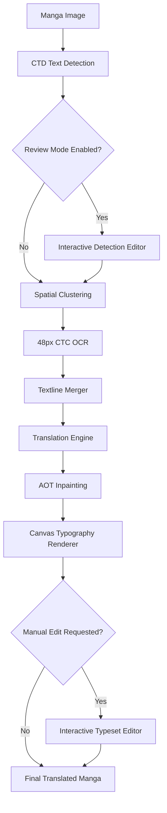

# Manga Translator Android

[](https://kotlinlang.org)
[](https://developer.android.com)
[](https://developer.android.com/jetpack/compose)
[](https://onnxruntime.ai)
[](LICENSE)

Native Android application based on [zyddnys/manga-image-translator](https://github.com/zyddnys/manga-image-translator), providing on-device AI manga translation, interactive text bubble correction, manual typesetting adjustment, and chapter batch processing powered by ONNX Runtime Mobile, OpenCV, and Jetpack Compose (Material Design 3).

Optimized specifically for translating raw **Japanese Manga (`JA / JPN`)** into **English, Indonesian, and other target languages** directly on mobile devices with comic-grade typesetting and neural inpainting.

> [!WARNING]
> ### Disclaimer
> * **Hardware Requirements:** Running deep learning models (CTD, 48px CTC OCR, AOT-GAN) directly on-device requires sufficient RAM and CPU processing. Performance depends on device specifications.
> * **Source Language Specialization:** The on-device 48px CTC OCR model and dictionary are specialized for Japanese Manga typography (Kanji, Hiragana, Katakana, Romaji, and common comic symbols). Translating non-Japanese comics is not supported.
> * **Edge Cases:** Highly distorted handwritten script, dense sound effects (SFX), or degraded low-resolution scans may require manual adjustment via the built-in interactive editors.

---

## Key Features

### 1. On-Device AI Pipeline
* **Comic Text Detection (CTD):** Deep learning segmentation to identify dialogue bubbles, rectangular narrative boxes, and panel textlines across complex layouts.
* **48px CTC OCR (Japanese Manga):** High-precision text recognition supporting vertical and horizontal Japanese textlines.
* **AOT-GAN Inpainting:** Neural image inpainting that removes original Japanese text strokes while preserving background artwork and screentones.

### 2. Interactive Correction & Typeset Editing
* **Detection Review Editor:**
  * Interactive canvas with pinch-to-zoom, pan, and double-tap gestures.
  * Add custom bounding boxes over missed dialogue bubbles.
  * Move and resize detection boundaries using corner drag handles.
  * Remove unwanted bounding boxes or ignore stylized sound effects (SFX).
* **Typeset & Render Editor:**
  * Real-time text block inspector directly over the inpainted image.
  * Modify translated dialogue text manually.
  * Adjust font size with increment/decrement steppers.
  * Adjust text alignment (Left, Center, Right).
  * Reposition and resize text rendered areas with live canvas updates.
  * Save modifications directly back to the database and update stored image files.

### 3. Batch Chapter Translation
* Select multiple manga pages from device storage or gallery.
* Automatic filename sorting for correct chapter page ordering.
* Sequential pipeline processing with live stage progress indicators.
* Page-level detection review and individual typeset editing for completed pages.
* Chapter album grouping in the gallery database with multi-page reader support.

### 4. Translation Engines
* Cloud API integration: **DeepL**, **Google Gemini**, **OpenAI (GPT-4o / GPT-4o-mini)**, **DeepSeek**, **Groq**, **OpenRouter**, and **Naver Papago**.
* Encrypted local storage for provider API keys.
* Fast re-translate capability to switch engines without re-running OCR and inpainting.

### 5. Gallery & Reader
* Chapter album grouping and single-page history cards.
* Instant toggle between original Japanese scan and translated output.
* Multi-select management with batch deletion.
* Native image sharing via Android system share sheet.

### 6. Comprehensive Localization
* Full multi-language user interface support:
  * English (Default)
  * Indonesian (Bahasa Indonesia)
  * Japanese (日本語)
  * Simplified Chinese (简体中文)

---

## Architecture

The application is built using Clean Architecture principles and MVVM pattern:

```text
┌───────────────────────────────────────────────────────────┐
│                    Presentation Layer                     │
│  Jetpack Compose • Material 3 • Navigation • ViewModels   │
│  Interactive Canvas Editors (Detection & Render Editors)  │
└─────────────────────────────┬─────────────────────────────┘
                              │
┌─────────────────────────────▼─────────────────────────────┐
│                       Domain Layer                        │
│   UseCases • Repository Interfaces • Pipeline Models      │
└─────────────────────────────┬─────────────────────────────┘
                              │
┌─────────────────────────────▼─────────────────────────────┐
│                        Data Layer                         │
│  ONNX Runtime • OpenCV • Room DB • DataStore • Retrofit   │
└───────────────────────────────────────────────────────────┘
```

* **UI Framework:** Jetpack Compose with Material Design 3
* **Dependency Injection:** Hilt
* **AI Runtime:** ONNX Runtime Mobile
* **Computer Vision:** OpenCV Android SDK
* **Image Loading:** Coil Compose
* **Local Storage:** Room Database (v3) & Jetpack DataStore Preferences
* **Asynchronous Operations:** Kotlin Coroutines & Flow

---

## Translation Pipeline Workflow



1. **Detection:** CTD produces text probability maps to isolate speech bubble coordinates.
2. **Review (Optional):** User inspects, adds, resizes, or removes detection boxes before OCR.
3. **OCR:** 48px CTC model extracts Japanese characters from cropped text regions.
4. **Textline Merging:** Merges disjointed vertical/horizontal textlines belonging to the same bubble.
5. **Translation:** Translates text via the configured translation engine.
6. **Inpainting:** AOT-GAN neural network cleans Japanese text strokes from the original image.
7. **Rendering & Typesetting:** Calculates line wrapping, applies white outlines, and draws text with CC Wild Words typeface.
8. **Typeset Editor (Optional):** User can fine-tune text alignment, font size, position, and wording.

---

## Build & Setup Instructions

### Prerequisites
* Android Studio Ladybug (2024.2.1+) or newer.
* JDK 17 or JDK 21.
* Android SDK: Compile SDK 35, Min SDK 26 (Android 8.0+).

### 1. Clone Repository
```bash
git clone https://github.com/yuu18id/manga-image-translator.git
cd manga-image-translator/android-app
```

### 2. Model Assets Placement
Place required ONNX models and dictionary files inside `app/src/main/assets/`:

```text
app/src/main/assets/
├── fonts/
│   └── cc-wild-words-roman.ttf
└── models/
    ├── alphabet-all-v5.txt
    ├── ctd_detector.onnx
    ├── ocr_ctc_48px.onnx
    └── aot_inpainter.onnx
```

Pre-converted models can be downloaded from the repository Releases section or exported from base PyTorch checkpoints using the conversion scripts in `models/`.

### 3. Build APK
```bash
# Verify compilation
./gradlew compileDebugKotlin

# Build Debug APK
./gradlew assembleDebug
```

Generated APK output directory:
`app/build/outputs/apk/debug/app-debug.apk`

---

## Settings & Configuration

The application **Settings** screen provides configuration for:
* **Translation Engine:** Select default provider (DeepL, Gemini, OpenAI, Groq, DeepSeek, OpenRouter, Papago).
* **API Keys:** Securely input and store provider keys.
* **Target Language:** Select default output language (English, Indonesian, etc.).
* **Storage Management:** View and clear translation cache and historical rendered image files.

---

## Acknowledgements

* **Base Project:** [zyddnys/manga-image-translator](https://github.com/zyddnys/manga-image-translator) for the original research, pipeline architecture, and training pipelines.
* **Comic Text Detector:** [dmMaze/ComicTextDetector](https://github.com/dmMaze/ComicTextDetector) for the deep learning text detection model.
* **Neural Inpainting:** [AOT-GAN](https://github.com/researchmm/AOT-GAN-for-Inpainting) for background reconstruction.
* **Typography:** *CC Wild Words Roman* comic typeface.

---

## License

This project is licensed under the **GNU General Public License v3.0 (GPLv3)**. See the [LICENSE](../LICENSE) file for full details.
