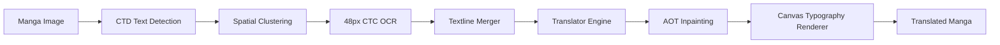

# Manga Translator Android

[](https://kotlinlang.org)
[](https://developer.android.com)
[](https://developer.android.com/jetpack/compose)
[](https://onnxruntime.ai)
[](LICENSE)

An advanced, native Android port based on the original [**zyddnys/manga-image-translator**](https://github.com/zyddnys/manga-image-translator) project, bringing **offline & on-device AI manga translation** to mobile devices powered by **ONNX Runtime Mobile**, **OpenCV**, and **Jetpack Compose (Material Design 3)**.

Specifically optimized for translating raw **Japanese Manga (`JA / JPN`)** into **English, Indonesian, and other target languages** directly on your phone with comic-grade typesetting and neural inpainting.

> [!WARNING]
> ### Disclaimer
> **This Android application is an experimental mobile port and proof-of-concept.**
> **Hardware Variation:** Running heavy deep learning models (CTD, OCR, AOT-GAN) directly on-device requires significant RAM and CPU/NPU processing. Performance may vary widely depending on device specifications.
> **Source Language Specialization:** The on-device 48px CTC OCR model and vocabulary dictionary (`alphabet-all-v5.txt`) are specifically trained on Japanese Manga characters (Kanji, Hiragana, Katakana, Romaji/Symbols). Translating non-Japanese comics is not supported.
> **Edge Cases & Imperfections:** Highly stylized handwritten text, dense SFX, complex gradients, or low-resolution scans may occasionally yield detection or inpainting imperfections.
> **Active Development:** Features and architecture are subject to continuous iteration. Pull Requests and community contributions are welcome, but please manage expectations regarding instant bugfixes for arbitrary comic formats.

---

## Features

* **On-Device AI Pipeline:**
  * **Comic Text Detection (CTD):** Deep learning segmentation to accurately detect text bubbles, panel dialogues, and SFX across complex manga layouts.
  * **48px CTC OCR (Japanese Manga):** High-precision character recognition supporting both vertical and horizontal Japanese text lines.
  * **AOT-GAN Inpainting:** Neural image inpainting that erases original text while seamlessly reconstructing background art and screen tones.
* **Multi-Engine Translation Support:**
  * Cloud LLM & API Integration: **DeepL**, **OpenAI (GPT-4o / GPT-3.5)**, **Google Gemini**, **DeepSeek**, **Groq**, and **Papago**.
  * Customizable API keys with persistent encrypted storage.
* **Comic-Grade Typography & Rendering:**
  * Built-in **CC Wild Words** comic typeface with automatic line-wrapping and hyphenation.
  * Bold, clean white outlines (`strokeWidth`) around black text for maximum readability over illustrations.
  * Automatic text orientation detection and spatial clustering.
* **Modern Material Design 3 UX:**
  * **Google Photos Style Multi-Select:** Contextual action bar, select all, batch deletion, and fluid animations.
  * **Interactive Reader Screen:** Pinch-to-zoom, pan, double-tap reset, quick original/translated comparison toggle, and native Android Share sheet.
* **History & Persistent Settings:**
  * Built with **Room Database** and **Jetpack DataStore** for persistent settings and offline translation history.

---

## Architecture & Tech Stack

The application follows **Clean Architecture** and **MVVM / MVI** best practices:

```text
┌───────────────────────────────────────────────────────────┐
│                    Presentation Layer                     │
│  Jetpack Compose • Material 3 • Navigation • ViewModels   │
└─────────────────────────────┬─────────────────────────────┘
                              │
┌─────────────────────────────▼─────────────────────────────┐
│                       Domain Layer                        │
│   UseCases • Repository Interfaces • Pipeline Models      │
└─────────────────────────────┬─────────────────────────────┘
                              │
┌─────────────────────────────▼─────────────────────────────┐
│                        Data Layer                         │
│  ONNX Runtime • OpenCV • Room DB • DataStore • Retrofit   │
└───────────────────────────────────────────────────────────┘
```

* **UI Framework:** [Jetpack Compose](https://developer.android.com/jetpack/compose) with Material Design 3 components.
* **Dependency Injection:** [Hilt](https://dagger.dev/hilt/)
* **AI Runtime:** [ONNX Runtime Mobile](https://onnxruntime.ai/docs/get-started/with-java.html)
* **Computer Vision:** [OpenCV Android SDK 4.9.0](https://opencv.org/)
* **Image Loading:** [Coil Compose](https://coil-kt.github.io/coil/compose/)
* **Database & Storage:** Room Database & Jetpack DataStore Preferences
* **Concurrency:** Kotlin Coroutines & Asynchronous Flow

---

## AI Translation Pipeline

The on-device inference workflow executes sequentially with real-time UI progress feedback:



1. **Detection:** CTD segments text probability heatmaps (1024×1024) and extracts precise polygon contours.
2. **OCR:** Textline crops are transformed and processed by the 48px CTC model to extract text.
3. **Textline Merging:** Disjointed vertical/horizontal textlines within the same bubble are unified into coherent dialogue blocks.
4. **Translation:** Dialogue is translated via your chosen engine (DeepL, Gemini, OpenAI, etc.).
5. **Inpainting:** AOT-GAN paints over original Japanese text strokes.
6. **Typesetting & Rendering:** Translated text is measured, wrapped, outlined, and drawn using Android 2D Canvas with Comic Wild Words font.

---

## Getting Started & Build Instructions

### Prerequisites
* **Android Studio:** Ladybug (2024.2.1+) or newer.
* **JDK:** Java 17 or Java 21.
* **Android SDK:** Compile SDK 35, Min SDK 26 (Android 8.0+).

### 1. Clone the Repository
```bash
git clone https://github.com/yuu18id/manga-image-translator.git
cd manga-image-translator
```

> [!IMPORTANT]
> ### AI Models Download
>
> #### Option A: Download from GitHub Releases (Recommended)
> 1. Go to the [**GitHub Releases Page**](../../releases) of this repository.
> 2. Download the pre-converted models archive (`models.zip` or individual `.onnx` files).
> 3. Place them inside `manga-image-translator/app/src/main/assets/models/`:
>    ```text
>    manga-image-translator/app/src/main/assets/
>    ├── fonts/
>    │   └── cc-wild-words-roman.ttf
>    └── models/
>        ├── alphabet-all-v5.txt
>        ├── ctd_detector.onnx
>        ├── ocr_ctc_48px.onnx
>        └── aot_inpainter.onnx
>    ```
>
> #### Option B: Self-Export from PyTorch Checkpoints
> If you prefer exporting the models yourself from base PyTorch checkpoints:
> ```bash
> cd manga-image-translator/models
> python export_ctd_onnx.py
> python export_ocr_ctc_onnx.py
> python export_aot_onnx.py
> ```
> For detailed export options and INT8 quantization, see the [Model Export Guide](models/README.md).

### 3. Build & Run
Open the `manga-image-translator` folder in Android Studio, or build via command line:

```bash
# Compile Kotlin and verify build
./gradlew compileDebugKotlin

# Assemble Debug APK
./gradlew assembleDebug
```
The generated APK will be available at:
`app/build/outputs/apk/debug/app-debug.apk`

---

## Configuration & Settings

Inside the app's **Settings** screen, you can configure:
* **Default Languages:** Source language is fixed to **Japanese (日本語)**, with customizable default target language (*English, Indonesian, etc.*).
* **Translation Provider:** Choose default translator (DeepL, Gemini, OpenAI, Groq, Papago).
* **API Keys:** Securely store API keys for cloud translation engines.
* **Model Quality:** Adjust text detection resolution (1024 / 1536 / 2048) and inpainting resolution (512 / 1024 / 2048).
* **Typography:** Adjust font size offset (-5 to +5).

---

## Acknowledgements & Credits

* **Core Research & Base Project:** This application is directly ported and inspired by the incredible open-source work of [**zyddnys/manga-image-translator**](https://github.com/zyddnys/manga-image-translator). Sincere gratitude to the original creators and contributors!
* **Comic Text Detection (CTD):** [dmMaze/ComicTextDetector](https://github.com/dmMaze/ComicTextDetector) for the state-of-the-art manga text detection model.
* **Neural Inpainting:** [AOT-GAN](https://github.com/researchmm/AOT-GAN-for-Inpainting) for background art restoration.
* **CTC OCR:** 48px CTC OCR model trained by the manga translation community.
* **Typography:** Comic font *CC Wild Words Roman*.

---

## License

This project is licensed under the **GNU General Public License v3.0 (GPLv3)**. See the root [LICENSE](../LICENSE) file for details.
